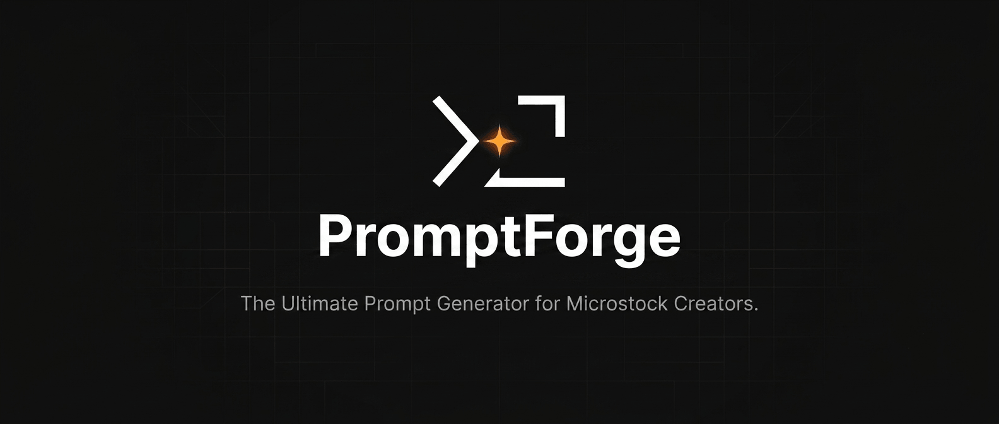

<div align="center">
  
  <h1>PromptForge</h1>
  <p><strong>A high-performance, IDE-inspired design language and application for AI Prompt Engineering.</strong></p>
</div>

PromptForge is a professional-grade prompt engineering tool designed to generate high-quality stock-image prompts with minimum repetition and high variation. It blends the cinematic restraint of professional creative tools with the ultra-fast, precision-driven feel of modern developer environments.


[](https://github.com/pyforgedev/promptforge/actions/workflows/ci.yml)
[](https://promptforge.pyforgedev.web.id/)

## Features

- **Prompt Generator:** Configurable aspect ratios (1:1, 16:9, etc.), niche selection, style presets (Commercial, Lifestyle, etc.), batch generation (1/3/5/10), target platform selection (DALL-E 3 / Nano Banana / Both), negative prompts, stock keywords toggling, Adobe Stock scoring, and photography segments.
- **Prompt Quality Rating:** Scores prompts on Commercial Potential, Creativity, Clarity, Marketability, and Uniqueness.
- **Duplicate Detection:** Similarity analysis against prompt history to prevent repetitive generations.
- **Templates:** Save, edit, reset, import, and export custom templates.
- **History:** Local cache using IndexedDB (Dexie), featuring search/filter by aspect ratio, style, rating, date, and TXT export/import.
- **Theme:** Strict Light/Dark/System theme support via next-themes, utilizing a semantic color system and glassmorphism.
- **Internationalization (i18n):** Full support for English (en) and Bahasa Indonesia (id).
- **Toast Notifications:** Standardized user feedback using sonner for all data-modifying actions.
- **Formatter:** Batch-format prompts from paste input or CSV upload, with queue management and download in TXT/CSV/JSON. See [Supported Paste Formats](./docs/supported-format-paste.md) for accepted input formats.

## Quick Start

> [!NOTE]
> Ensure you have [Node.js](https://nodejs.org/) >= 22.12.0 installed before proceeding.

### 1. Clone the repository

```bash
git clone https://github.com/pyforgedev/promptforge.git
cd promptforge
```

### 2. Install dependencies

```bash
npm install
```

### 3. Start the development server

```bash
npm run dev
```

The application will be available at `http://localhost:5173`.

## Architecture and Tech Stack

PromptForge uses a modular, feature-based architecture structured into dedicated layers to enforce separation of concerns, scalability, and maintainability.

### Architecture Layers

- **Feature-Based Modules (`src/features/`):** Self-contained domains encapsulating components, hooks, schemas, state slices, and assets relevant to specific features (e.g., prompt generator, history, templates).
- **Services Layer (`src/services/`):** External integrations and core application business logic, including AI API clients, a per-domain IndexedDB storage layer (Dexie) behind a barrel re-export, export utilities, and text similarity algorithms.
- **State Management (`src/store/`):** Zustand-powered stores managing global application state, including AI configuration, generator preferences, and historical logs.
- **Routing Layer (`src/app/`):** React Router DOM v7 utilizing `createBrowserRouter` for declarative, lazy-loaded routing, error boundaries, and nested layout structures.

### Core Technologies

- **Framework:** React 19 + TypeScript + Vite 8
- **Styling:** Tailwind CSS v4 (via `@tailwindcss/vite` plugin) + Shadcn UI (Radix UI primitives) + React Bits (animated components) + Framer Motion 12
- **Icons:** Lucide React (UI) + `@icons-pack/react-simple-icons` (brand icons)
- **State Management:** Zustand 5
- **Storage:** Dexie 4 (IndexedDB) + `dexie-react-hooks` — current schema is v9, with a dedicated `cryptoKeys` table that persists the non-extractable AES-GCM master key and a `settings` table holding sensitive config (e.g. `active_ai_config`, `ai_config_presets`) encrypted at rest.
- **Form & Validation:** React Hook Form + Zod 4
- **Routing:** React Router DOM v7
- **Internationalization:** i18next 26 + `react-i18next` + `i18next-browser-languagedetector`
- **HTTP Client:** Axios
- **Analytics:** `@vercel/analytics`

## Project Structure

```
src/
├── main.tsx                          # Entry point
├── App.tsx                           # Root component (router, toaster, analytics)
├── index.css                         # Tailwind entry
├── theme.config.ts                   # Theme configuration
├── app/
│   ├── pages.tsx                     # Lazy-loaded page imports (uniform *Page naming)
│   ├── routePaths.ts                 # Centralized route path constants (ROUTES)
│   ├── router.ts                     # Router creation
│   ├── routes.tsx                    # Route definitions
│   └── providers/                    # App providers
├── components/
│   ├── common/                       # AppLogo, EmptyState, LazyFallback, LoadingSpinner, PageHeader
│   ├── forms/                        # FormField
│   ├── layout/                       # Header, Layout, Sidebar
│   ├── ui/                           # Shadcn UI primitives (button, card, dialog, select, etc.)
│   └── *.tsx                         # React Bits animated components (AnimatedContent, Aurora, SpotlightCard, etc.)
├── features/
│   ├── formatter/                    # Prompt formatting & queue (components, types)
│   ├── history/                      # Prompt history (components, hooks, types)
│   ├── prompt-generator/             # V2 prompt composer (components, engine, hooks, schemas, services, store, types, constants)
│   ├── prompts/                      # Prompt utilities (components, hooks, services, types, utils)
│   ├── settings/                     # Settings (components, services, types)
│   └── templates/                    # Default template definitions
├── hooks/                            # Shared hooks (useAppContext, useEffectiveTheme, useFavicon, useSpotlightBorder, useToast)
├── i18n/                             # i18next configuration
├── lib/                              # Utilities (axiosSetup, constants, crypto, eventBus, rateLimiter, sanitizeError, utils, validation)
├── pages/                            # Page components (Home, GeneratorPage, HistoryPage, TemplatesPage, Settings, FormatterPage, ErrorPage)
├── services/
│   ├── ai/                           # AI service (API integration)
│   ├── export/                       # Export services (history, txt)
│   ├── formatter/                    # Formatter batch services
│   ├── similarity/                   # Duplicate detection service
│   └── storage/                      # Per-domain Dexie modules (db, history, folders, settings, generatorState, ideaCache, formatter, prompts) + indexeddb.ts barrel
├── store/                            # Zustand stores (AIConfig, Generator, History, MasterPrompt)
├── test/                             # Test setup and utilities
└── types/                            # Shared TypeScript types
```

## Routes

- `/` → HomePage (landing page)
- `/dashboard` → Redirects automatically to `/templates`
- `/formatter` → Prompt formatter (paste/CSV input, queue, download)
- `/generator` → V2 Prompt Generator
- `/history` → Prompt history log
- `/templates` → Template management page
- `/settings` → Configuration page (AI config, theme, and locale)

## Design System

PromptForge implements a strict design system detailed in [`DESIGN.md`](./DESIGN.md). Key highlights include:

- **Component Priority:** components are selected in strict order — shadcn/ui first for all interactive patterns (Radix primitives with built-in ARIA and keyboard support), then React Bits (TS + Tailwind variants via the `@react-bits` registry in `components.json`, e.g. `npx shadcn@latest add @react-bits/<Name>-TS-TW`) for animation-forward components shadcn doesn't ship (text entrances, spotlight cards, backgrounds), then Framer Motion for custom motion primitives (skeleton shimmer, layout animations), and custom Tailwind/CSS only as the last resort when none of the three fit or deep customization is needed (e.g. scrollbar styling, keyframe utilities).
- **Semantic Colors:** Strict adherence to semantic variables (`bg-surface`, `text-primary`) rather than hardcoded hex values.
- **Glassmorphism:** Mandatory for all floating elements (overlays, dropdowns, modals) to maintain spatial hierarchy.
- **Typography:** Developer-centric typography utilizing `Geist` for UI elements and a monospace font (`JetBrains Mono` or `Geist Mono`) for outputs, prompts, and scores to convey precision.
- **Streaming UI:** Instantaneous feel with text streaming interfaces and skeleton loaders for pending data.

## Available Scripts

- `npm run dev`: Starts the development server with Vite.
- `npm run build`: Performs TypeScript validation and creates a production build.
- `npm run lint`: Performs lint checks via ESLint.
- `npm run preview`: Previews the local production build.
- `npm run test`: Runs the Vitest test suite in watch mode.
- `npm run test:run`: Runs the Vitest test suite once.

> [!TIP]
> The testing setup utilizes Vitest 4, `@testing-library/react`, `@testing-library/jest-dom`, and `fake-indexeddb` to execute tests under a simulated IndexedDB environment.

## Security

PromptForge is a **client-side only** application — no data leaves your browser except explicit AI provider requests you initiate. Sensitive settings (including your configured API key) are encrypted at rest with AES-GCM 256 in IndexedDB; the master key is a non-extractable `CryptoKey` persisted in the same database. This is *encrypted-at-rest, not zero-leak*. See [`SECURITY.md`](./SECURITY.md) for the full threat model, and the *"Don't remember API key between sessions"* setting for a true zero-leak mode in which the API key is kept only in memory.

## Contributing

Contributions are welcome! Please see [CONTRIBUTING.md](./CONTRIBUTING.md) for guidelines, [CODE_OF_CONDUCT.md](./CODE_OF_CONDUCT.md) for community standards, and [SECURITY.md](./SECURITY.md) for reporting vulnerabilities.

## License

This project is licensed under the MIT License - see the [LICENSE](./LICENSE) file for details.
